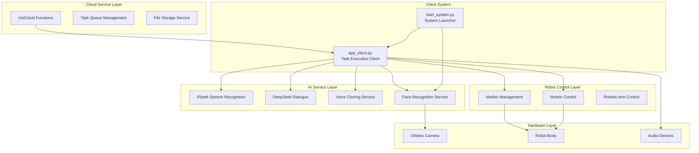
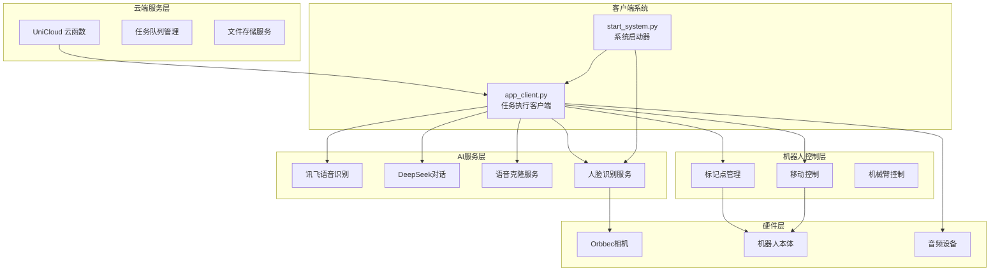

# HAVEN Intelligent Control System / HAVEN智能控制系统

[](LICENSE)
[](https://python.org)
[]()

[English](#english) | [中文](#chinese)

---

## English

### 🌟 Project Overview

The Xuanwu Intelligent Control System is a comprehensive AI agent platform based on the MCP protocol, integrating speech recognition, natural language dialogue, robot control, facial recognition, and personalized interaction capabilities. The system adopts a modular design, supports distributed deployment, and features powerful task scheduling and execution capabilities.

#### 🎯 Core Features

- **Intelligent Task Scheduling**: Distributed task processing system based on cloud polling
- **Multimodal Interaction**: Speech recognition, speech synthesis, facial recognition, natural language dialogue
- **Robot Control**: Marker point management, path planning, patrol missions
- **Personalized Memory**: User profile management, conversation history, personalized responses
- **Voice Cloning**: Personalized voice training and generation
- **Cloud Integration**: Seamless integration with UniCloud functions

### 🏗️ System Architecture



### 🚀 Quick Start

#### System Requirements

- Python 3.8+
- Supported OS: Linux (recommended), macOS, Windows
- Hardware: Orbbec camera, robot body, audio devices

#### Installation Steps

1. **Clone the Project**
```bash
git clone <repository-url>
cd xuanwu_control
```

2. **Environment Setup**
```bash
# Create face environment (for face recognition)
conda create -n face python=3.8
conda activate face
pip install insightface pyorbbecsdk opencv-python flask requests

# Create base environment (for main system)
conda create -n base python=3.8
conda activate base
pip install requests flask chardet openai numpy scipy
```

3. **Configuration Setup**
```bash
# Configure API keys
cp config/voices.json.example config/voices.json
# Edit configuration files and fill in corresponding API keys
```

4. **Start System**
```bash
# Method 1: Full system startup
cd demos
python start_system.py

# Method 2: Client only startup
python app_client.py
```

### 📋 Main Functional Modules

#### 🎤 Speech Processing System
- **Speech Recognition**: Based on iFlytek Spark ASR, supports Chinese speech-to-text
- **Speech Synthesis**: Supports personalized voice cloning and generation
- **Audio Recording**: High-quality audio capture and processing

#### 🤖 Intelligent Dialogue System
- **DeepSeek Dialogue Engine**: Intelligent conversation based on large language models
- **Context Understanding**: Maintains conversation history and user profiles
- **Personalized Response**: Customized replies based on user characteristics

#### 👁️ Facial Recognition System
- **Real-time Face Detection**: High-precision face recognition based on InsightFace
- **User Identity Management**: Supports multi-user registration and identity verification
- **Face Tracking**: Intelligent face following and gaze functionality

#### 🚶 Robot Control System
- **Marker Point Management**: Dynamic addition, deletion, and navigation to specified markers
- **Path Planning**: Intelligent patrol route planning and execution
- **Motion Control**: Precise position control and navigation

#### 💾 Data Management System
- **User Profiles**: Personalized user information storage and management
- **Memory System**: Semantic memory storage and retrieval
- **Configuration Management**: Dynamic system configuration updates

### 🔧 Configuration

#### Main Configuration Files

- `config/voices.json`: Voice configuration and default tone settings
- `config/patrol_routes.json`: Patrol route configuration
- `demos/data/profiles/`: User profile storage directory

#### API Key Configuration

Configure the following API keys in `demos/app_client.py`:

```python
SPARK_APP_ID = 'your_spark_app_id'
SPARK_API_SECRET = 'your_spark_api_secret'
SPARK_API_KEY = 'your_spark_api_key'
DEEPSEEK_API_KEY = 'your_deepseek_api_key'
```

### 💡 Usage Examples

#### Basic Voice Dialogue
```python
# After starting the client, the system automatically polls cloud tasks
# Supported task types:

# 1. Speech recognition to dialogue
task = {
    "task": "speech_to_text",
    "params": {"audioUrl": "https://example.com/audio.pcm"}
}

# 2. Text dialogue
task = {
    "task": "dialogue", 
    "params": {"text": "Hello, how's the weather today?"}
}

# 3. Robot navigation
task = {
    "task": "move_to_point",
    "params": {"marker_name": "living_room"}
}
```

#### User Profile Management
```python
# Get user profiles
task = {
    "task": "get_profiles_config"
}

# Update user profile
task = {
    "task": "update_profile",
    "params": {
        "profile_id": "user123",
        "profile_data": {
            "name": "John Doe",
            "preferences": ["music", "reading"],
            "personality": "friendly"
        }
    }
}
```

### 🔄 Task Scheduling Mechanism

The system adopts a cloud polling-based task scheduling mechanism:

1. **Task Submission**: Submit tasks to queue through UniCloud functions
2. **Task Polling**: Client periodically polls cloud for pending tasks
3. **Task Execution**: Call corresponding processing modules based on task type
4. **Status Update**: Real-time feedback of execution results to cloud
5. **Error Handling**: Comprehensive error handling and retry mechanisms

### 🧪 Testing and Debugging

#### Run Tests
```bash
# System connection test
python start_system.py test

# Voice recording test
python test_recording.py

# Dialogue system test
python test_optimization.py
```

#### Debug Mode
```bash
# Enable verbose logging
export DEBUG=1
python app_client.py
```

### 📦 Project Structure

```
xuanwu_control/
├── demos/                      # Demos and main applications
│   ├── app_client.py           # Main client program
│   ├── start_system.py         # System startup script
│   ├── data/                   # Data storage
│   │   └── profiles/           # User profiles
│   └── run_temp/               # Temporary files
├── src/                        # Source code modules
│   ├── super_intelligent_agent.py  # Super intelligent agent
│   ├── face_recognition_*.py   # Face recognition modules
│   ├── memory_agent.py         # Memory agent
│   ├── marker_manager.py       # Marker point management
│   ├── move_controller.py      # Motion control
│   ├── audio_recorder.py       # Audio recording
│   ├── spark_asr.py           # Speech recognition
│   ├── deepseek_dialog.py     # Dialogue system
│   └── voice_cloner.py        # Voice cloning
├── config/                     # Configuration files
│   ├── voices.json            # Voice configuration
│   └── patrol_routes.json     # Patrol routes
└── README.md                  # Project documentation
```

### 🤝 Contributing

Welcome to submit Issues and Pull Requests to improve the project:

1. Fork the project
2. Create feature branch (`git checkout -b feature/AmazingFeature`)
3. Commit changes (`git commit -m 'Add some AmazingFeature'`)
4. Push to branch (`git push origin feature/AmazingFeature`)
5. Open Pull Request

### 📄 License

This project is licensed under the MIT License - see [LICENSE](LICENSE) file for details

### 📞 Contact

- Project Maintainer: [Maintainer Name]
- Email: [Contact Email]
- Project Homepage: [Project Link]

### 🙏 Acknowledgments

Thanks to the following open source projects and services:

- [InsightFace](https://github.com/deepinsight/insightface) - Face Recognition
- [Orbbec SDK](https://github.com/orbbec/pyorbbecsdk) - Depth Camera
- [iFlytek Open Platform](https://www.xfyun.cn/) - Speech Services
- [DeepSeek](https://www.deepseek.com/) - Intelligent Dialogue
- [UniCloud](https://unicloud.dcloud.net.cn/) - Cloud Services

---

## Chinese

### 🌟 项目概述

玄武智能控制系统是一个基于MCP协议的综合性AI智能体平台，集成了语音识别、自然语言对话、机器人控制、人脸识别、个性化交互等功能。系统采用模块化设计，支持分布式部署，具备强大的任务调度和执行能力。

#### 🎯 核心特性

- **智能任务调度**: 基于云端轮询的分布式任务处理系统
- **多模态交互**: 语音识别、语音合成、人脸识别、自然语言对话
- **机器人控制**: 支持标记点管理、路径规划、巡逻任务
- **个性化记忆**: 用户档案管理、对话历史、个性化响应
- **语音克隆**: 个性化语音训练和生成
- **云端集成**: UniCloud云函数无缝集成

### 🏗️ 系统架构



### 🚀 快速开始

#### 环境要求

- Python 3.8+
- 支持的操作系统: Linux (推荐), macOS, Windows
- 硬件要求: Orbbec相机、机器人本体、音频设备

#### 安装步骤

1. **克隆项目**
```bash
git clone <repository-url>
cd xuanwu_control
```

2. **环境配置**
```bash
# 创建face环境 (人脸识别)
conda create -n face python=3.8
conda activate face
pip install insightface pyorbbecsdk opencv-python flask requests

# 创建base环境 (主系统)
conda create -n base python=3.8
conda activate base
pip install requests flask chardet openai numpy scipy
```

3. **配置文件设置**
```bash
# 配置API密钥
cp config/voices.json.example config/voices.json
# 编辑配置文件，填入相应的API密钥
```

4. **启动系统**
```bash
# 方式一: 完整系统启动
cd demos
python start_system.py

# 方式二: 仅客户端启动
python app_client.py
```

### 📋 主要功能模块

#### 🎤 语音处理系统
- **语音识别**: 基于讯飞Spark ASR，支持中文语音转文字
- **语音合成**: 支持个性化语音克隆和生成
- **音频录制**: 高质量音频采集和处理

#### 🤖 智能对话系统
- **DeepSeek对话引擎**: 基于大语言模型的智能对话
- **上下文理解**: 维护对话历史和用户画像
- **个性化响应**: 根据用户特征定制回复内容

#### 👁️ 人脸识别系统
- **实时人脸检测**: 基于InsightFace的高精度人脸识别
- **用户身份管理**: 支持多用户注册和身份验证
- **人脸跟踪**: 智能人脸跟随和注视功能

#### 🚶 机器人控制系统
- **标记点管理**: 动态添加、删除、导航到指定标记点
- **路径规划**: 智能巡逻路线规划和执行
- **移动控制**: 精确的位置控制和导航

#### 💾 数据管理系统
- **用户档案**: 个性化用户信息存储和管理
- **记忆系统**: 语义记忆存储和检索
- **配置管理**: 系统配置动态更新

### 🔧 配置说明

#### 主要配置文件

- `config/voices.json`: 语音配置和默认音色设置
- `config/patrol_routes.json`: 巡逻路线配置
- `demos/data/profiles/`: 用户档案存储目录

#### API密钥配置

在 `demos/app_client.py` 中配置以下API密钥:

```python
SPARK_APP_ID = 'your_spark_app_id'
SPARK_API_SECRET = 'your_spark_api_secret'
SPARK_API_KEY = 'your_spark_api_key'
DEEPSEEK_API_KEY = 'your_deepseek_api_key'
```

### 💡 使用示例

#### 基本语音对话
```python
# 启动客户端后，系统自动轮询云端任务
# 支持的任务类型:

# 1. 语音识别转对话
task = {
    "task": "speech_to_text",
    "params": {"audioUrl": "https://example.com/audio.pcm"}
}

# 2. 文本对话
task = {
    "task": "dialogue", 
    "params": {"text": "你好，今天天气怎么样？"}
}

# 3. 机器人导航
task = {
    "task": "move_to_point",
    "params": {"marker_name": "客厅"}
}
```

#### 用户档案管理
```python
# 获取用户档案
task = {
    "task": "get_profiles_config"
}

# 更新用户档案
task = {
    "task": "update_profile",
    "params": {
        "profile_id": "user123",
        "profile_data": {
            "name": "张三",
            "preferences": ["音乐", "阅读"],
            "personality": "友善"
        }
    }
}
```

### 🔄 任务调度机制

系统采用基于云端轮询的任务调度机制:

1. **任务提交**: 通过UniCloud云函数提交任务到队列
2. **任务轮询**: 客户端定期轮询云端获取待执行任务  
3. **任务执行**: 根据任务类型调用相应的处理模块
4. **状态更新**: 执行结果实时反馈到云端
5. **错误处理**: 完善的错误处理和重试机制

### 🧪 测试与调试

#### 运行测试
```bash
# 系统连接测试
python start_system.py test

# 语音录制测试
python test_recording.py

# 对话系统测试
python test_optimization.py
```

#### 调试模式
```bash
# 启用详细日志
export DEBUG=1
python app_client.py
```

### 📦 项目结构

```
xuanwu_control/
├── demos/                      # 演示和主要应用
│   ├── app_client.py           # 主客户端程序
│   ├── start_system.py         # 系统启动脚本
│   ├── data/                   # 数据存储
│   │   └── profiles/           # 用户档案
│   └── run_temp/               # 临时文件
├── src/                        # 源代码模块
│   ├── super_intelligent_agent.py  # 超级智能体
│   ├── face_recognition_*.py   # 人脸识别模块
│   ├── memory_agent.py         # 记忆智能体
│   ├── marker_manager.py       # 标记点管理
│   ├── move_controller.py      # 移动控制
│   ├── audio_recorder.py       # 音频录制
│   ├── spark_asr.py           # 语音识别
│   ├── deepseek_dialog.py     # 对话系统
│   └── voice_cloner.py        # 语音克隆
├── config/                     # 配置文件
│   ├── voices.json            # 语音配置
│   └── patrol_routes.json     # 巡逻路线
└── README.md                  # 项目说明
```

### 🤝 贡献指南

欢迎提交Issue和Pull Request来改进项目:

1. Fork 项目
2. 创建特性分支 (`git checkout -b feature/AmazingFeature`)
3. 提交更改 (`git commit -m 'Add some AmazingFeature'`)
4. 推送到分支 (`git push origin feature/AmazingFeature`)
5. 打开 Pull Request

### 📄 许可证

本项目采用 MIT 许可证 - 查看 [LICENSE](LICENSE) 文件了解详情

### 📞 联系方式

- 项目维护者: [维护者姓名]
- 邮箱: [联系邮箱]
- 项目主页: [项目链接]

### 🙏 致谢

感谢以下开源项目和服务:

- [InsightFace](https://github.com/deepinsight/insightface) - 人脸识别
- [Orbbec SDK](https://github.com/orbbec/pyorbbecsdk) - 深度相机
- [讯飞开放平台](https://www.xfyun.cn/) - 语音服务
- [DeepSeek](https://www.deepseek.com/) - 智能对话
- [UniCloud](https://unicloud.dcloud.net.cn/) - 云服务

---

**Version / 版本**: 2.0  
**Last Updated / 更新日期**: 2025-01-30  
**Development Environment / 开发环境**: Python 3.8+, Linux/macOS/Windows